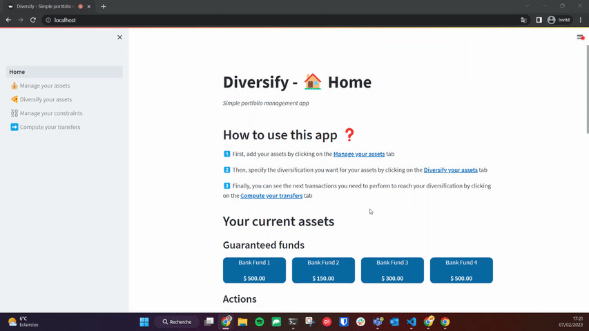
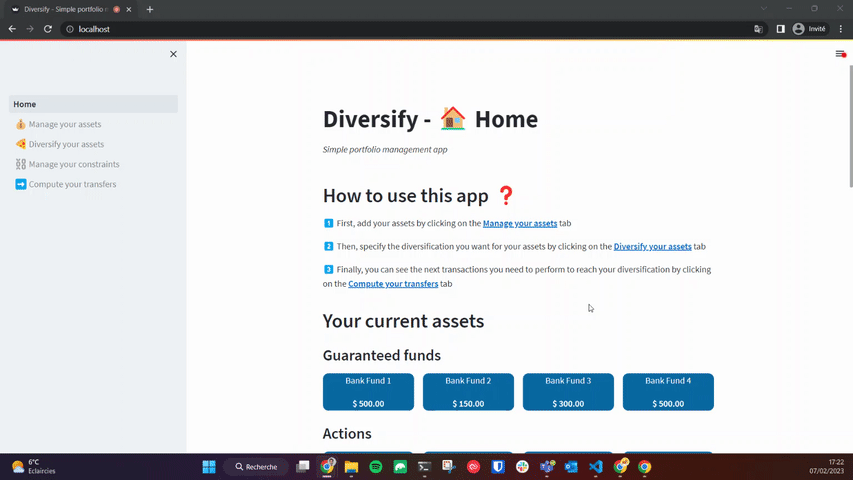

# Diversify

**Diversify** is a *simple portfolio management app*

In **Diversify**, you can **add, update and delete** your assets and their values. You can also specify a target diversification that you can to reach and some constraints, then, **Diversify** will compute for you the optimal transfers to perform to reach this allocation.

## Basic usage

### Asset management
You can **add an asset** to each asset family (Guaranteed funds, Actions or Real Estate) along with **its value**.



You can also **update an asset value**.



Finally, you can **delete an asset**.


### Optimal transfers computation

Once you specified your assets, the target allocation you wish to reach and your constraints, you can let **Diversify compute your transfers for you**.


## Local development

**Diversify** can be run locally using `docker compose` with the command:

```
docker compose up
```